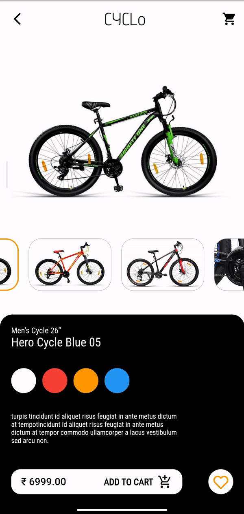

# snapshot_carousel

Flutter package for image carousel

## Installation

pubspec.yaml:

```yaml
dependencies:
  snapshot_carousel: ^0.0.1
```

or

```
$ flutter pub add snapshot_carousel
```

### Import package

```
import 'package:snapshot_carousel/snapshot_carousel.dart';
```

### How to use

Simply create a `snapShotCarousel` widget, and pass the required parameters:

```dart
 snapShotCarousel(
     List<Image> imageList,

      {
        Color backgroundColor = Colors.white,

        Color selectedImageBorderColor = Colors.orange,

        Color unselectedImageBorderColor = Colors.grey,

        double imageHeight = 250,

        double selectedImageBorderWidth = 2,

        double unselectedImageBorderWidth = 0.5,

        double borderRadius = 20,

        double featureImageBorderRadius = 0,

        Border featureImageBorder,

        List<BoxShadow> featureImageBoxShadow
      }
    ),
```

### Example

```dart
import 'package:flutter/material.dart';

class ImageDisplayWidget extends StatefulWidget {
  List<String> images = [
          "https://d2f9uwgpmber13.cloudfront.net/public/uploads/mobile/7c902eb8a6f1f3453fc9e0e99f34838c",
          "https://d2f9uwgpmber13.cloudfront.net/public/uploads/mobile/d774dd3de09fe0ecf043ddb9383c76bc",
          "https://d2f9uwgpmber13.cloudfront.net/public/uploads/mobile/a9b4f4f1e7a144941d9c072e13937eab",
          "https://d2f9uwgpmber13.cloudfront.net/public/uploads/mobile/87e5d8fda7b970c4fe5ffd23ad400436"
        ];

  @override
  _ImageDisplayWidgetState createState() => _ImageDisplayWidgetState();
}

class _ImageDisplayWidgetState extends State<ImageDisplayWidget> {
  int index = 0;

  onTap(int index) {
    setState(() {
      this.index = index;
    });
  }

  @override
  Widget build(BuildContext context) {
    return Column(
      children: [
        Padding(
          padding: const EdgeInsets.all(18.0),
          child: Container(
            height: 250,
            child: Center(
              child: ClipRRect(
                borderRadius: BorderRadius.circular(20),
                child: Image.network(
                  widget.images[index],
                  fit: BoxFit.fitWidth,
                ),
              ),
            ),
          ),
        ),
        Container(
          height: 100,
          child: ListView.builder(
            itemCount: widget.images.length,
            itemBuilder: (ctx, i) {
              return ImagePlaceHolderWidget(
                  widget.images[i], index == i, onTap, i);
            },
            scrollDirection: Axis.horizontal,
          ),
        )
      ],
    );
  }
}

class ImagePlaceHolderWidget extends StatelessWidget {
  String imageUrl;
  bool isSelected;
  Function onTap;
  int index;

  ImagePlaceHolderWidget(
      this.imageUrl, this.isSelected, this.onTap, this.index);

  @override
  Widget build(BuildContext context) {
    return Padding(
      padding: const EdgeInsets.all(8.0),
      child: ClipRRect(
        borderRadius: BorderRadius.circular(20),
        child: FlatButton(
            padding: EdgeInsets.all(0),
            onPressed: () {
              onTap(index);
            },
            child: Container(
              child: ClipRRect(
                  child: Image.network(imageUrl),
                  borderRadius: BorderRadius.circular(20)),
              decoration: BoxDecoration(
                borderRadius: BorderRadius.circular(20),
                border: isSelected == true
                    ? Border.all(color: Colors.orange, width: 2)
                    : Border.all(width: .5, color: Colors.grey),
              ),
            )),
      ),
    );
  }
}

```

## Screen Shot



## License

MIT
